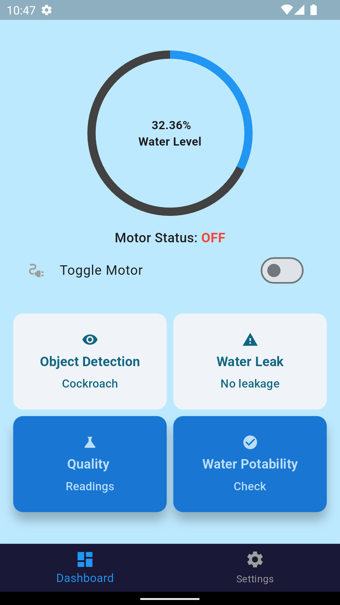
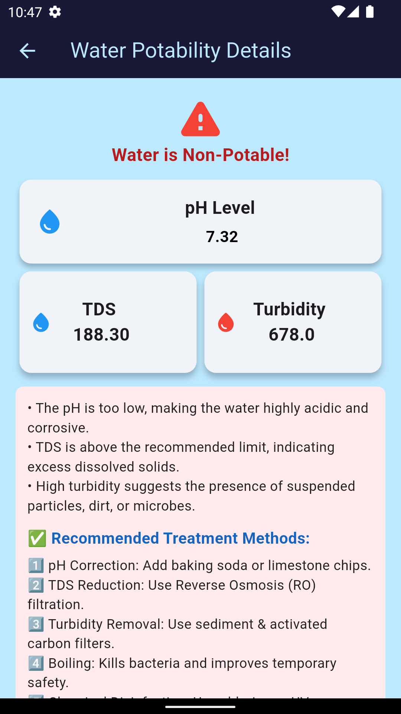
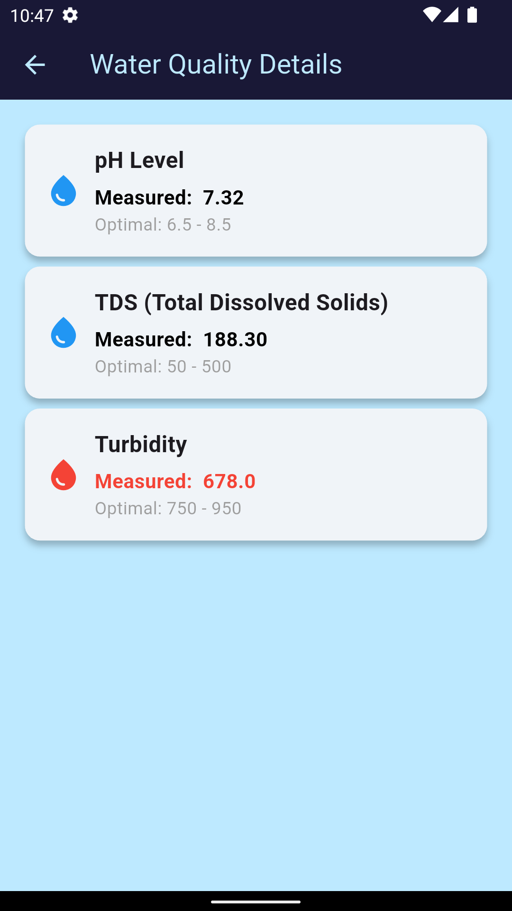

# 💧 Smart Water Tank Monitoring System

An IoT-based smart water tank system with real-time monitoring, water potability checks, object detection, and a Flutter-based Android app with Firebase authentication and Thingspeak.

---

## 🚀 Features

- 📶 Real-time water level and quality monitoring  
- 🔍 Object detection using camera module  
- 🧪 Water potability check (pH, turbidity, conductivity)  
- 🔐 Secure login via Firebase Authentication  
- 📱 Flutter Android app with live dashboard  
- ☁️ Firebase and Thingspeak integration for data storage and updates  
- 🔔 Alerts for unsafe water or unexpected activity  

---

## 🛠️ Tech Stack

- **Frontend**: Flutter (Dart)  
- **Backend**: Firebase, Thingspeak
- **Microcontroller**: ESP32, Arduino
- **Sensors**:
  - pH Sensor  
  - Turbidity Sensor  
  - Conductivity Sensor  
  - Ultrasonic Sensor (for water level)  
  - Camera Module (for object detection)

---

## 🧪 Water Potability Parameters

| Parameter     | Safe Range         |
|---------------|--------------------|
| pH            | 6.5 – 8.5           |
| Turbidity     | < 5 NTU             |
| Conductivity  | < 500 µS/cm         |

---

## 📱 Screenshots

  
  
  
  

